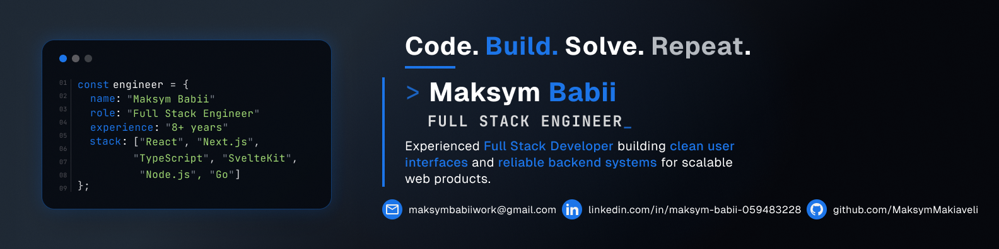

<h1 align="center">Maksym Babii - Senior Full Stack Engineer</h1>

  <strong>Senior Full Stack Engineer with 8 years of experience, working across the stack. I take products from an empty repository to production and own the frontend architecture and internal tooling the rest of the team builds on. I carry the same ownership on the server side.</strong>

---

## Tech Stack

**Languages**

**Frontend**

**Backend**

**Cloud, Data, Auth**

**Tooling**

## Contact

  
  
  
  

